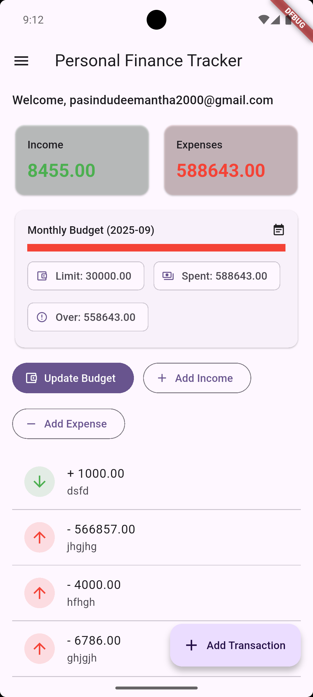
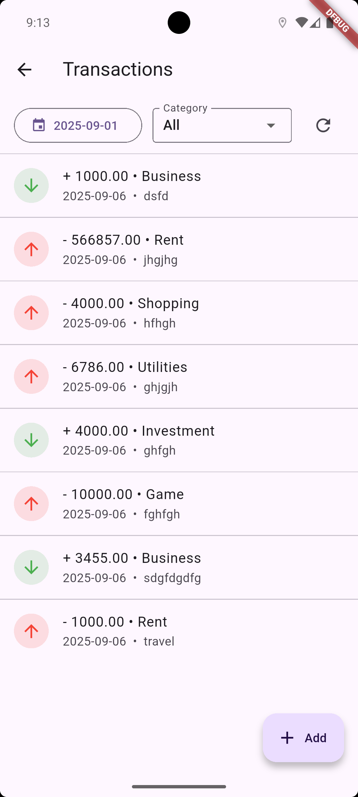
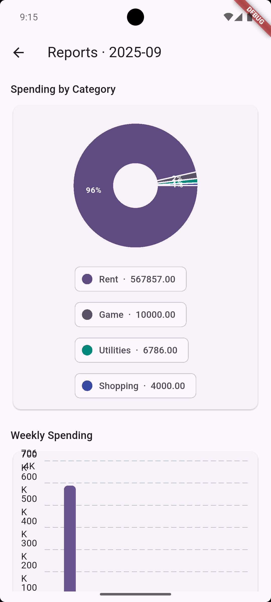
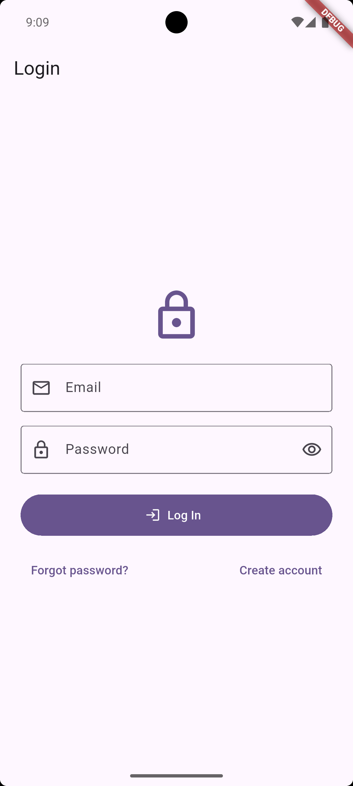
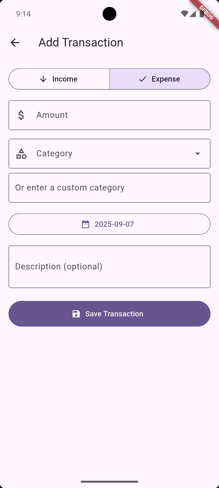

# Personal Tracker

Personal finance tracker built with Flutter and Firebase. Track income and expenses, set monthly budgets, and visualize spending with simple reports.

**Tech Stack**
- **Flutter**: cross‑platform UI (Android, iOS, web, desktop)
- **Dart 3**: app logic and state management
- **Firebase Auth**: email/password authentication
- **Cloud Firestore**: per‑user data storage
- **Provider**: app state and reactive UI
- **fl_chart**: basic charts for reports

**Key Features**
- **Authentication**: email/password login and registration
- **Transactions**: add income/expense with category, date, note
- **Filters**: by date and category on the transactions list
- **Budgets**: default monthly limit and month overrides
- **Dashboard**: monthly income/expense summary and budget progress
- **Reports**: spending by category (pie) and weekly (bar)

**Screenshots**

  
  
  

Additional screens:

  
  
  

**Project Structure**
- `lib/main.dart`: app entry, Firebase init, routes, auth gate
- `lib/home/home_page.dart`: shell with drawer and FAB
- `lib/dashboard/dashboard_page.dart`: monthly overview and budget controls
- `lib/transactions/transactions_page.dart`: list + filters
- `lib/transactions/add_edit_transaction_page.dart`: add/edit form
- `lib/transactions/transaction_model.dart`: model helper
- `lib/reports/reports_page.dart`: charts and insights
- `lib/services/*`: Firestore refs, transactions, budgets
- `lib/state/app_state.dart`: date range + category filter (Provider)
- `lib/widgets/*`: snackbars and error views

**Firestore Data Model**
- `users/{uid}/transactions/{id}`: `{ type, amount, category, description, date, createdAt }`
- `users/{uid}/settings/budget`: `{ monthlyLimit }`
- `users/{uid}/budgets/{yyyy-MM}`: `{ limit }` (month override)
