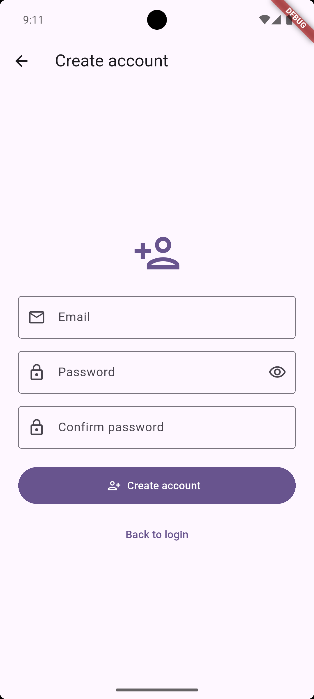

# Personal Tracker

Personal finance tracker built with Flutter and Firebase. Track income and expenses, set monthly budgets, and visualize spending with simple reports.

**Tech Stack**
- **Flutter**: cross‑platform UI (Android, iOS, web, desktop)
- **Dart 3**: app logic and state management
- **Firebase Auth**: email/password authentication
- **Cloud Firestore**: per‑user data storage
- **Provider**: app state and reactive UI
- **fl_chart**: basic charts for reports

**Key Features**
- **Authentication**: email/password login and registration
- **Transactions**: add income/expense with category, date, note
- **Filters**: by date and category on the transactions list
- **Budgets**: default monthly limit and month overrides
- **Dashboard**: monthly income/expense summary and budget progress
- **Reports**: spending by category (pie) and weekly (bar)

**Screenshots**
- Place PNGs in `screenshots/` using these names, and GitHub will render them below:
  - `1_login.png`, `2_register.png`, `3_dashboard.png`, `4_transactions.png`, `5_add_transaction.png`, `6_reports.png`

  
  
  

Additional screens:

  
  
  

**Project Structure**
- `lib/main.dart`: app entry, Firebase init, routes, auth gate
- `lib/home/home_page.dart`: shell with drawer and FAB
- `lib/dashboard/dashboard_page.dart`: monthly overview and budget controls
- `lib/transactions/transactions_page.dart`: list + filters
- `lib/transactions/add_edit_transaction_page.dart`: add/edit form
- `lib/transactions/transaction_model.dart`: model helper
- `lib/reports/reports_page.dart`: charts and insights
- `lib/services/*`: Firestore refs, transactions, budgets
- `lib/state/app_state.dart`: date range + category filter (Provider)
- `lib/widgets/*`: snackbars and error views

**Prerequisites**
- `Flutter` (stable) with Dart `>= 3.8.1` (see `pubspec.yaml`)
- A Firebase project (Firestore + Authentication enabled)
- Android: Android SDK; iOS: Xcode + CocoaPods (on macOS)

**Firebase Setup**
- This repo includes FlutterFire config for Android:
  - `lib/firebase_options.dart`
  - `android/app/google-services.json`
- To add iOS/web/desktop, run FlutterFire and follow prompts:
  - `dart pub global activate flutterfire_cli`
  - `flutterfire configure`
- Ensure Firestore and Email/Password Auth are enabled in Firebase Console.

**Firestore Data Model**
- `users/{uid}/transactions/{id}`: `{ type, amount, category, description, date, createdAt }`
- `users/{uid}/settings/budget`: `{ monthlyLimit }`
- `users/{uid}/budgets/{yyyy-MM}`: `{ limit }` (month override)

**Getting Started**
- Install packages: `flutter pub get`
- Run the app: `flutter run`
  - Use a connected device or emulator; pick target in your IDE or with `-d <deviceId>`

**Build**
- Android APK: `flutter build apk`
- iOS (release): open `ios/Runner.xcworkspace` in Xcode and archive
- Web: `flutter build web` (outputs to `build/web`)

**Quality**
- Analyze: `flutter analyze`
- Tests: `flutter test` (see `test/widget_test.dart`)

**Android Notes**
- Kotlin DSL is used for Gradle (`build.gradle.kts`). Google Services plugin is applied in `android/app/build.gradle.kts`, and its version is managed in `android/settings.gradle.kts`.

**Troubleshooting**
- **Firebase initialization errors**: re‑run `flutterfire configure` to regenerate `lib/firebase_options.dart` and platform files.
- **Missing Google services files**: ensure `android/app/google-services.json` (Android) and `ios/Runner/GoogleService-Info.plist` (iOS) exist and match your Firebase project.
- **Permission denied / Firestore rules**: while developing, you can use basic per‑user rules like:
  - Match `users/{userId}/**` and allow read/write only when `request.auth != null && request.auth.uid == userId`.
  - Tighten rules before production.

**Taking Screenshots**
- Run on a device or emulator and capture:
  - Android Studio: Device Manager → three‑dot menu → Take Screenshot
  - iOS Simulator: File → New Screenshot (Cmd+S) or Cmd+S shortcut
  - CLI (Android): `adb exec-out screencap -p > screenshots/3_dashboard.png`

**License**
- Provided as‑is for personal use. Add your preferred license if distributing.
